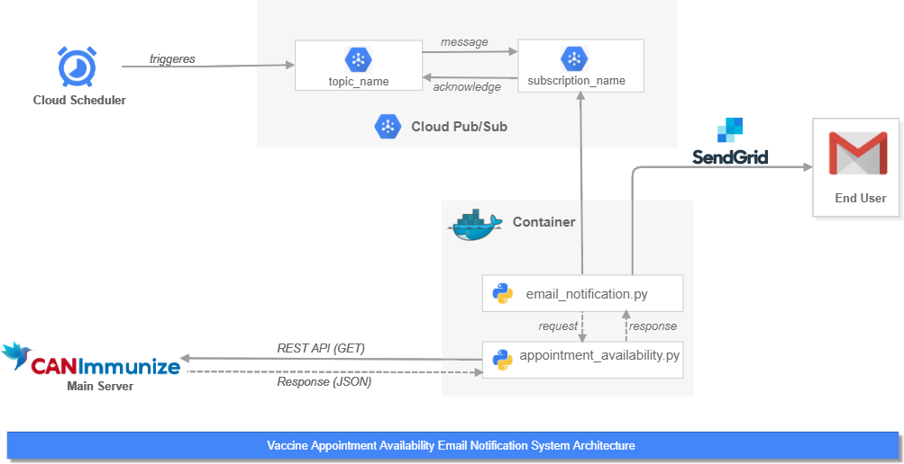

# Nova Scotia COVID-19 Vaccine Appointment Availability #

This program prints all clinics in Nova Scotia where COVID-19 vaccine appointment is available. 

Note:- This can only work for Nova Scotia (one of the provinces of Atlantic Canada)



## Installation ##

- This program is based on Python language. So, the first step is to install Python 3, if haven't installed in machine yet.

    To verify if Python is installed correctly, run this command inside command prompt / terminal:

    ```
    python --version
    ```

- (Optional Step) For running python, it is always recommended to have different virtual envs. for each project. So, make a new virtual environment:

    ```
    pip install virtualenv
    virtualenv ns-vaccine-appointment-venv
    ```

    Next, activate the virtual environment:

    For Windows:
    ```
    ns-vaccine-appointment-venv\Scripts\activate
    ```

    For Mac / Linux:
    ```
    source ns-vaccine-appointment-venv/bin/activate
    ```

- Install the required open-source libraries to run this program:

    ```
    pip install -r requirements.txt
    ```

## Run ##

In order to get the list of clinics in real time for specific filters, we will need to run a python program:

```
python appointment_availability.py
```

We can modify the filters by changing variable values inside main method.

